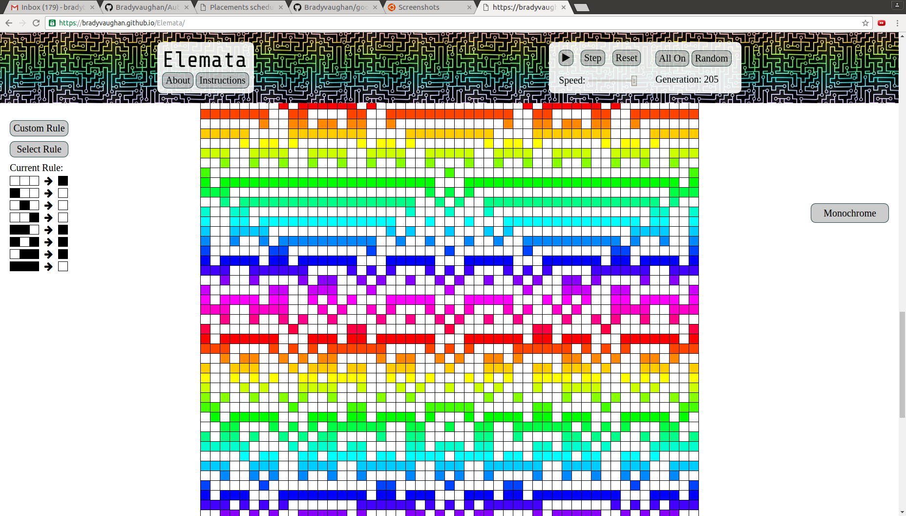
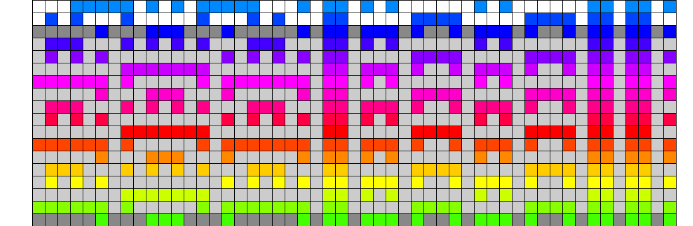

# An Exploration of Elementary Cellular Automata

## Background

Elemata explores elementary **cellular automata**.  In an elementary cellular automaton, there is a line of cells, each of which may be on or off.  Each generation of the automaton is calculated deterministically from the arrangement of the previous generation.  That is, there is a transition function for each cell which maps the old state of the cell and each of its neighbors to a new state.  Because there are 8 possible arrangements of three cells, (000, 100, 010, ..etc) and each of them may map to one of two states, there are 2^8 or 256 possible elementary transition rules.  Elemata is a tool for visualizing the behavior of these rules over time.

## Features & Implementation

Elemata has four primary features:

- Visualization of an automaton

- Custom automaton creation

- Rainbow mode

- Cycle detection

### Automaton Visualization

Elemata's core functionality is tracking the evolving state of an automaton and rendering it onto the screen in a way that the user can follow and understand.  It does this by representing 'on' states with a black square, and 'off' states with a white square.  Only the latest row changes, with all previous rows showing past states of the automaton.  The user
will watch the automaton evolve in real time.

### Custom Automata

There are four preset automata accessible from a drop-down menu for the user to explore.  If she is intrigued, she may instead opt to create her own automata and experiment with them.  Since there are 256 possible automata, it would be onerous to pre-program all of them in, but the sites modular design ensures that every possible custom automaton can be created through the modal.

### Rainbow Mode

Just for fun, the user may decide that she'd like a more colorful experience.  With a simple toggle, she can convert the stark pictures from above into a vibrant animation.  Rainbow mode can be toggled on and off freely while the automaton runs.

### Cycle detection

Given the finite length of the automata that I study, all of them are guaranteed to enter a cycle within the first 2^51 iterations.  Since it would be pointless to continue to show the same oscillating pattern forever, Elemata automatically detects cycles and halts the automaton, giving the user a brief message and highlighting the beginning, end, and duration of the cycle.

The beginning and end of a cycle are highlighted in dark gray, while the body is
highlighted in a lighter gray.

## Future Directions for the Project

As with any tool, there is more I can do to improve elemata.

###  Improved Custom Menu

I would like to use the 'current rule' display seen in the left side of the 'rainbow mode' screenshot as the custom automaton menu so that the user's experience doesn't need to be interrupted by a modal.

###  Custom Auto Saving

I would also like the user to be able to save automata that they have created and particularly like as personal presets to be quickly accessible through the drop-down.

###  Conversion to React

My use of jQuery's append function is causing the system to slow the longer it runs, despite the calculations not growing any more complex.  I could solve this problem by converting to react.
