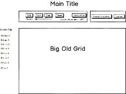

## An Exploration of Elementary Cellular Automata

### Background

This project explores elementary **cellular automata**.  In an elementary cellular automaton, there is a line of cells, each of which may be on or off.  Each generation of the automaton is calculated deterministically from the arrangement of the previous generation.  That is, there is a transition function for each cell which maps the old state of the cell and each of its neighbors to a new state.  Because there are 8 possible arrangements of three cells, (000, 100, 010, ..etc) and each of them may map to one of two states, there are 2^8 or 256 possible elementary transition rules.

Many of these rules are boring, but a number of them lead to some quite interesting behavior.  This project will visualize these automata for the user's viewing pleasure.  A number of the more interesting rules will come preprogrammed, accessible through a menu.  If the user is intrigued, she will be able to build her own rules in another menu accessible through a modal.  In addition to selecting rules, the viewer will also be able to choose starting configurations by clicking on the squares of the initial array.

Although the automata are one dimensional, they will be displayed through a scrolling grid so that the user can immediately visualize how the system has changed over time.

### Functionality & MVP  

With this elementary cellular automaton simulator, users will be able to:

- [ ] Start, pause, and reset the game board
- [ ] Select squares to be alive in the initial state
- [ ] Choose from preset demo rules
- [ ] Be able to make custom rule sets for the automaton to run.

In addition, this project will include:

- [ ] An About modal describing the background and rules of the game
- [ ] A production Readme

### Wireframes

This app will consist of a single screen with game board, game controls, and nav links to the Github, as well as the About and Custom Rule modals.  Game controls will include Start, Stop, and Reset buttons as well as a slider to control the speed. On the left there will be illustrations that summarize the current transition rules.  Additionally, a drop-down will be added to the Controls to toggle between different rule sets.

### Architecture and Technologies

**NB**: one of the main things you should be researching and deciding upon while you write this proposal is what technologies you plan to use.  Identify and create a plan of attack for the major technical challenges in your project.  It's okay if you don't have all the details of implementation fleshed out, but you should have a solid roadmap by Monday morning.

This project will be implemented with the following technologies:

- Vanilla JavaScript and `jquery` for overall structure and game logic,
- `Easel.js` with `HTML5 Canvas` for DOM manipulation and rendering,
- Webpack to bundle and serve up the various scripts.

In addition to the webpack entry file, there will be three scripts involved in this project:

`board.js`: this script will handle the logic for creating and updating the necessary `Easel.js` elements and rendering them to the DOM.

`automata.js`: this script will handle the logic behind the scenes.  An Automata object will hold an array of `Cell`s.  It will be responsible for doing neighbor checks for each `Cell` upon iteration and updating the `Cell` array appropriately.

`cell.js`: this lightweight script will house the constructor and update functions for the `Cell` objects.  Each `Cell` will contain an `aliveState` (`true` or `false`).

### Implementation Timeline

**Day 0 (Sunday)**:  Setup the project.  Make sure that webpack is happy and that all of the necessary resources are installed.  See if I can get something to appear on the screen.  Daily goals:

- Happy webpack
- Something rendered to the screen.

**Day 1**: Work on the display.  Make sure that I can render a grid, and that the squares can be interacted with.  Build out `Cell` and `Board`, use Easel to make a picture.  Make the squares clickable to toggle state.  If there is time left, begin work on the running of the automaton.  Daily goals:

- Complete the `cell.js` module (constructor, update functions)
- Render a square grid to the `Canvas` using `Easel.js`
- Make each cell in the grid clickable, toggling the state of the square on click

**Day 2**: Create the automata logic backend. Incorporate the automata logic into the `Board.js` rendering.  Get at least one transition rule to work.  Then, make the transition rules modular so that all possible elementary automata can be rendered.  Daily goals:

- Export an `Automata` object with correct type and handling logic
- Have a functional grid on the `Canvas` frontend that correctly handles iterations from one generation of the game to the next

**Day 3**:  Add user interaction.  Make the start/stop/step/reset buttons, make them perform the appropriate actions.  Get the speed slider to work, write out the summary/instructions.  Make the dropdown full of preset automata.  If time left, make the modal for custom rules.  Daily goals:

- setup the entire user interface to be functional, if not pretty.

**Day 4**: Bughunt, make it pretty, smooth any rough edges.  Daily goals:

- Entire project finished, beautiful, bug free.

### Bonus features

The natural extension of two states to three would make the exhaustive customization that is the driving idea behind this project unreasonable, so instead of doing that, I believe that the following would be a better bonus feature.fgafgas

- [ ] System remembers entire state, user can save the state from generation x to generation y as an image.
